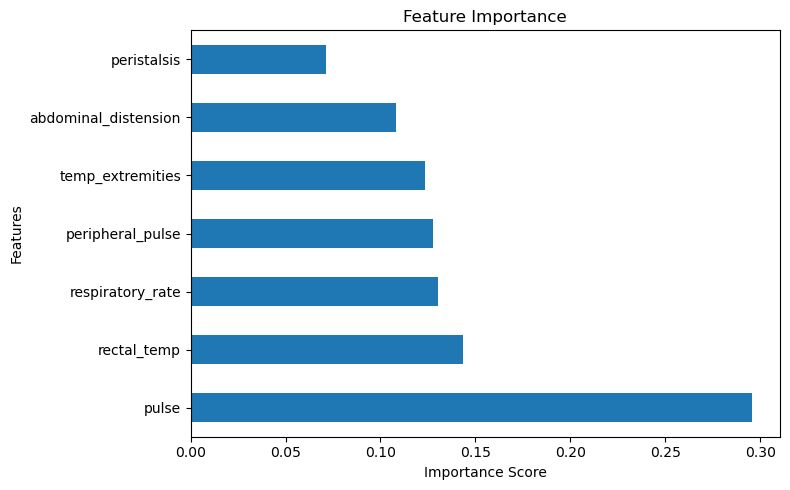
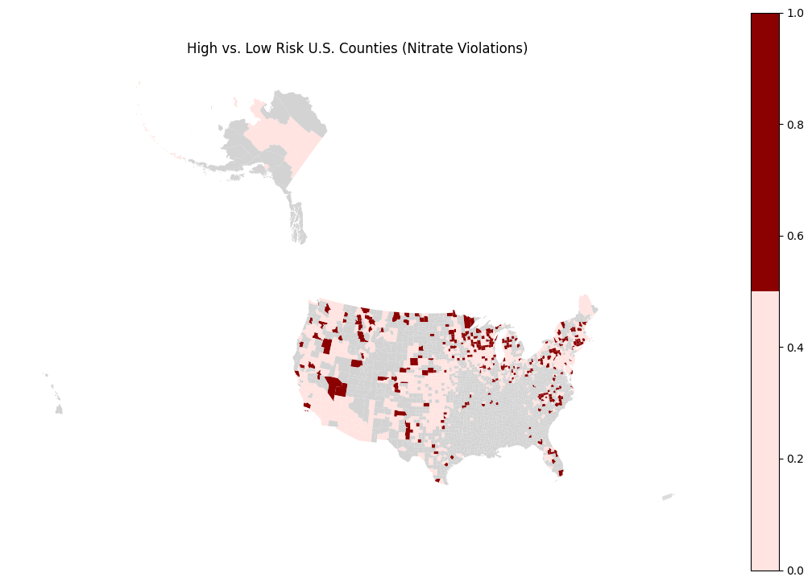

# Kaylee Paterson

# About
I'm a Data Science student at UNC Charlotte with a strong interest in artificial intelligence, machine learning, and business intelligence. I enjoy working with data to uncover patterns and translate information into actions. Through these projects I am refining my skills and working on launching my career even further. 

# Projects
[Project 1: Olympics HDI Study](https://github.com/kpaters4/Olympic-Medals-and-HDI/blob/main/notebooks/eda.ipynb)

[Project 2: Predicting Horse Colic](https://github.com/kpaters4/Horse-Colic-Prediction)

[Final Project: Water Safety Research](https://github.com/kpaters4/water-safety-research)

# Blog

## Social and Interdisciplinary Context in Data Science
01-16-26

Data science is inherently interdisciplinary. It rarely exists by itself, and is instead applied to other industries. It is often used to analyze social topics, such as researching demographics or predicting behaviors. When using data about people, it is important to remember the context that the data exists in. If the data includes a marginalized group, this needs to be taken into consideration by the analyst. Is there a lack of data about them, does the minority need to be weighted heavier, and is the data even accurate or is it corrupted by bias? I'm hoping to learn how to utilize interdisciplinary knowledge to show a true reflection of the data I am analyzing. 

## Ethically Ambiguous Data Modeling
01-27-26

Ethically ambiguous data modeling refers to situations where there is a grey area. Sometimes a problem has no perfect solution. Evem when best pracitices are followed and analysts have good intentions, there is often still a question of fairness and potential harm. Most real world problems are messy, with incomplete data and embedded historical biases. This is incredibly common and often unavoidable, so data scientists face the task of learning how to deal with it responsibly. 

One of the most commen grey areas is in performance metrics. Evaluating success is a common and necessary task, but these success metrics often leave out important details and do not reflect the bigger picture. Aside from the obvious issue of success being subjective, these models can have incomplete data and biased historical records. Even an accurate model may contribute to ongoing harm by reinforcing bias. These are unavoidable risks, so data scientists can implement a few techniques to mitigate potential harms.

**Data Auditing**
Datasets should be audited for missing information, under representation, and sensitive proxy variables. Identifying these issues can help flag potential risks before modeling and visualization begin. It is important to understand what data should not be represented, what cannot be represented, and what may be affected by historical bias.

**Stakeholder Assessment**
Another step to be taken before modeling even begins is stakeholder impact assessment. Analysts need to ask themselves and understand what this data represents, who could be impacted by it, and who cares. Stakeholders often have conflicting interests, which is a particularly tricky issue for ethical data analysis. Identifying vulnerable populations and looking at the bigger picture can help data scientists make decisions on how to handle these ambiguous situations.

**Model Interpretability**
After a model is created, understanding it is the most important part of harm reduction. Model interpretability is incredibly important because it allows a human eye to review the decisions made by the model and flag any potential problems with it. Understanding how a model works is the first step of improving it.

Implementing these practices helps manage ethical ambiguity. It usually isn't possible to completely remove that grey area, but with these practices it is possible to reduce it.

## Opportunities and Capabilities
02-20-26

We typically think about health in terms of physical wellbeing or nutrition, highly valuing physical activity and food. The Social Determinants of Health are all of the other things that shape your health. This includes things like socioeconomic status, local community, education, and neighborhood. All of these factors impact a person's health. For example, a person who can't afford healthy food options or may not even live in an area near them will have a different level of health than a wealthier individual with plenty of healthy options around them. A person with less education may not even fully understand the ways food will impact their health. The Capabilities Approach is a similar concept, but is more focused on what a person is able to do rather than what they have. This looks closer at a person's ability to reasonably achieve something, such as a person's ability to pursue education. Two people who have the same income and education will have different capabilities if one faces discrimination. It's less about the existence of options and more about the ability to choose them. 

The two ideas are very similar and closely connected, mostly differing in their focus on choice. The Social Determinants heavily impact what Capabilities a person has. The capabilities are the ability to pursue and take advantage of those determinants. A person may be allowed to pursue education, but if the actual educational facilities are not accessible then in practice they are not free to pursue education.

The social determinants are easier to measure than the capabilities, simply look at basic things like education level, income, neighborhood pollution, etc. The capabilities are a little more difficult, but it can still be measured by looking at how people are using the options around them. Are people choosing to participate in community events? Are they able to pursue education and rise in economic class? Looking at both frameworks together gives a better idea of how to measure quality of life. 

## Predicting Horse Colic with Wearable Data
[Project 2: Predicting Horse Colic](https://github.com/kpaters4/Horse-Colic-Prediction)

04-06-26

### The Problem
What are the main indicators of colic severity in horses, and is it possible to track them with wearables?

Colic is a common but incredibly dangerous medical condition for horses. It presents suddenly, requires immediate treatment, and is the leading cause of death in horses. The Horse Colic dataset from UCI Machine Learning Repository contains data on many different biometrics, many of which could be tracked with wearables. If several key metrics are trackable with wearable devices, then it could lead to owners being notified of a potential problem and horses getting early treatment.

### Why This Matters

Animals often struggle to communicate their discomfort, so real time data analysis could make a huge difference in animal healthcare. 

Horses are both companions and high value athletes. The equestrian industry has a clear economic incentive to maintain the health of these high value horses and invest in improvements to healthcare technology. Most importantly, developing a method of predicting colic could save countless horses' lives.

### The Approach

To investigate this, I used the Horse Colic dataset from UCI Machine Learning Repository, which contains medical data from hundreds of horses diagnosed with colic. However, not all medical measurements are possible to be gathered with wearable devices. I narrowed the focus to biometrics that could reasonably be tracked in real time, such as:

- Heart rate (pulse)
- Body temperature
- Respiratory rate
- Indicators of circulation and gut activity

I then trained machine learning models to predict the severity of the cases. This was determined by the outcome, whether the horse survived or not. Since this is a binary classification problem, I started with a Decision Tree model. I prioritized a high recall, especially on the lethal cases. 

### The Findings

The final Random Forest model achieved significantly higher recall for the "died" class compared to the Decision Tree models. This is very important for this use case, as the goal is to minimize false negatives (cases where a severe condition is missed).

The improvement in recall can be attributed to a few things. The Random Forest model is simply better suited to this problem. As stated earlier, it handles the complexities of the dataset well. Also, class weighting made a huge difference in prioritising lethal cases.

The feature importance plot highlights which measurable variables contribute most to predicting severe outcomes. Pulse and abdominal distension rank highly, indicating a strong relationship with colic severity. This supports the hypothesis that wearable devices tracking cardiovascular activity and physical changes could be effective in early detection. However, none of the individual variables has a particularly strong correlation with severity, meaning that it is the combination of these metrics that allows the predictions to work.

Recall was prioritized for this project, since missing a severe case of colic could have lethal consequences. A higher recall for the "died" class was prioritized over the overall recall. As shown in the chart, the overall recall rate is roughly 80%. This means that the majority of severe cases can be predicted, but this is not high enough to be a reliable tool.

This suggests that wearable monitoring of these metrics could provide meaningful early warning signals for severe colic cases, as well as other conditions.

### Limitations and Ethics

This analysis has several limitations:

- The dataset contains a high percentage of missing values, which may reduce model accuracy.
- Many features included in the wearable subset are not currently measurable with standard wearable devices and would require advancements in technology.
- The dataset is relatively small, which limits the available training data for the model.
- Clinical data contains subjectivity (e.g., pain levels), which wearables are unable to track.
- Each horse is different, and this model does not account for the normal conditions of each horse.

From an ethical perspective, false positives may lead to unnecessary concern or intervention, while false negatives could result in delayed treatment and harm to the animal. This model performed well, but not well enough. Several lethal cases of colic went unnoticed, which could lead to the horse going untreated.

If too much trust is placed in wearable devices false negatives are highly dangerous. Reliance on automated systems should not replace professional veterinary judgment but rather serve as a supplementary tool.

### References

- [UCI Machine Learning Repository: Horse Colic Dataset](https://archive.ics.uci.edu/dataset/47/horse+colic)
- [Scikit-learn documentation](https://scikit-learn.org/stable/)

### AI Transparency

ChatGPT was used to assist with debugging and explanation of machine learning concepts. All final decisions, analysis, and interpretations were completed by me.

## Predicting Water System Violations
[Final Project: Water Safety Research](https://github.com/kpaters4/water-safety-research)

### Problem Definition

Water is essential for all life, but not all water is clean. A 2026 report by the Environmental Working Group found that almost 1 in 5 Americans drink water containing nitrates linked to cancer and birth defects (Schechinger, 2026). The concern is real, and it hits hardest in low-income and rural communities that often lack the resources to monitor and maintain their water systems.  
On a grander scale are water system violations. Huge supplies of water that exceed contamination limits, people failing to report test results, and pipe bursts or failures. There are many reasons why this can happen, and it can easily result in ongoing public health issues, especially in communities already stretched thin. We wanted to know: can machine learning identify which counties are most at risk for water violations before those violations happen?

### The Data

We used data from the EPA's Safe Drinking Water Information System (SDWIS), which covers around 160,000 public water systems across the U.S. (EPA, 2017). The data included nitrate violation records, population served per county, and groundwater and surface water contamination rates collected between 1994 and 2016\.

### What We Found

Our model was able to correctly identify high-risk counties about 83% of the time. More importantly, it caught roughly 70% of truly high-risk counties. This means it would flag most of the places that actually need attention before a violation occurs.     

When we mapped the results, high-risk counties clustered heavily in the Midwest and Northeast. The map above shows predicted high-risk counties in dark red, with clear concentrations across the agricultural Midwest. One likely explanation for this geographic pattern is agricultural runoff. Fertilizers contain high concentrations of nitrogen that crops don't fully absorb, and that excess nitrogen drains into groundwater and surface water supplies. This issue is worsened by federal agricultural policies that subsidize the production of crops requiring high amounts of fertilizer.

Our K-Means clustering revealed four distinct types of counties, shown in the map above. The most alarming group was small, rural counties with the highest per-capita violation rates, which are communities with the fewest resources and the worst water quality outcomes.

### Why It Matters

The communities hit hardest by water violations are often the least equipped to fight back. Small rural counties in our highest-risk cluster had disproportionately high violation rates despite serving far fewer people. When systems fail in these places, there are fewer resources, less media attention, and slower government response. This reflects a broader pattern of environmental injustice, where communities with the least political and economic power are most exposed to public health risks.

There is also a significant data problem. Because the SDWIS only contains self-reported state data, roughly two-thirds of U.S. counties could not be mapped at all (EPA, 2017). The counties missing from our results are likely the smaller, less regulated systems that need the most oversight, which means our findings may actually underestimate the true scale of the problem.

Machine learning won't fix water infrastructure, but tools like this could help direct limited inspection and funding resources toward the places most likely to need them before a violation becomes a public health crisis.

### Broader Impact

The benefits of a model like this are clear: earlier identification of at-risk systems means faster intervention and potentially fewer people exposed to contaminated water. However, the potential harms are also important to consider. A tool like this could be misused to avoid investing in communities by labeling them as perpetually high-risk instead of prioritizing them for support. In addition, because our data underrepresents rural and lower-income counties, the model may systematically miss the most vulnerable places. These are exactly the communities this kind of work is meant to protect.

### References

Safe Drinking Water Information System (SDWIS) Federal Reports Advanced  Search Tool.    
	(2017, June 30). Data.gov; U.S. EPA Office of Research and Development (ORD).    
	https://catalog.data.gov/dataset/safe-drinking-water-information-system-sdwis   
	\-federal-reports-advanced-search-tool 

   
Ground Water and Drinking Water | US EPA. (2013, February 20). US EPA.    
	https://www.epa.gov/ground-water-and-drinking-water/ 

   
Schechinger, Anne. “Drinking Water of Almost 1 in 5 Americans Contains Nitrates Linked    
	to Cancer and Birth Defects.” Environmental Working Group, 23 Apr. 2026,    
	www.ewg.org/research/drinking-water-almost-1-5-americans-contains-nitrates   
	\-linked-cancer-and-birth-defects
